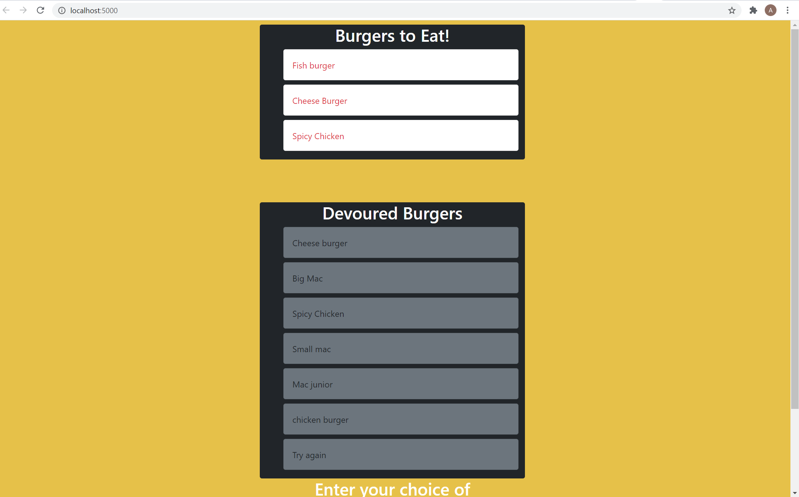

# Burger

## Description

This is a full stack application that follows the MVC design pattern. The program allows users to input their choice of burger. Whenever the user submits a burger’s name the app will display it on the burgers t eat list of the page waiting to be devoured. When the user clicks on the burgers on that list, it will be moved to the devoured burgers list of the page and both created and devoured burgers will be stored in the database.

## Table of Contents

* [Installation](#installation)
* [Usage](#usage)
* [contributing](#credits)
* [Issues](#issues)
* [Questions](#questions)

## Installation
The program uses MYSQL, ORM and Node to query and route data in the app. Express for the backend web framework and handlebars to dynamically generate the HTML.

## Usage
To run this application locally, Install the dependencies, verify database connection information, run the database in my SQL Workbench. Run `node server.js` on your terminal to start the server and follow the link or open it on your browser to view the application your computer(locally). The application running on Heroku can be found [Here](https://safe-beach-77092.herokuapp.com/)

## Contribution

When contributing to this repository, please first discuss the change you wish to make via issue, email, or any other method with the owners of this repository before making a change.

## Issues

Feel free to submit issues and enhancement requests.

## Questions?

For any questions you may have, feel free to find me via the information provided below:

Email:
afetyusuf.gggnc@gmail.com

[Github Page](https://github.com/HananYusuf/)
HananYusuf

